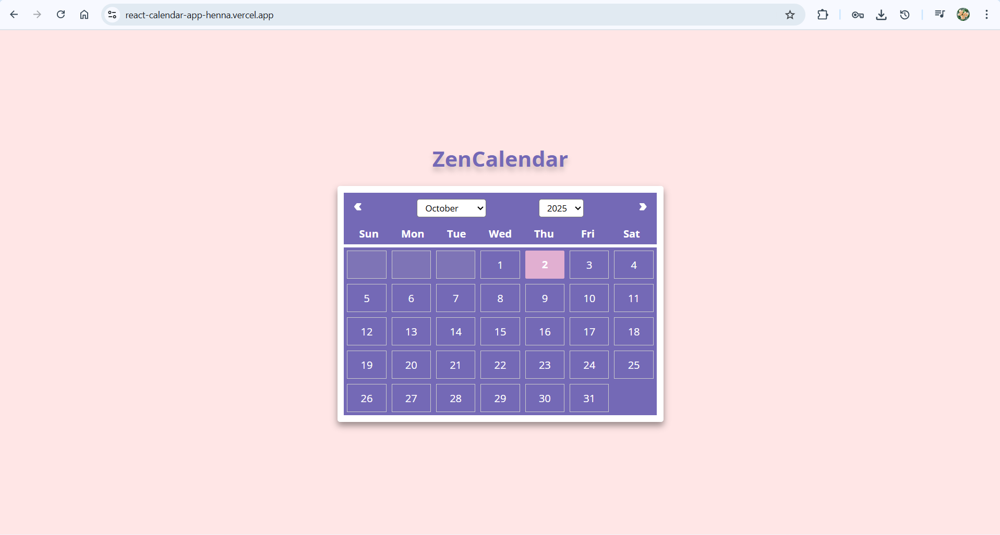

# React ZenCalendar

A Calendar App built with **React**.  
It is a clean and minimal calendar app that displays the current date and day.

## 🌐 Live Demo
Check out the live version of this project [here](https://react-calendar-app-henna.vercel.app/).

## 🚀 Features
- Displays current date and day
- Lightweight and fast – Minimal UI for easy use
- Built with **React Hooks**

## 📸 Preview


## 🛠️ Technologies Used
- **React.js**  
- **JavaScript**  
- **HTML5**  
- **CSS3**  
- **Vite**
- **React Icons**
- **Prettier**

## 📦 Installation
```bash
git clone https://github.com/osvi-25/react-ZenCalendar.git
cd react-ZenCalendar
npm install
npm start
```


